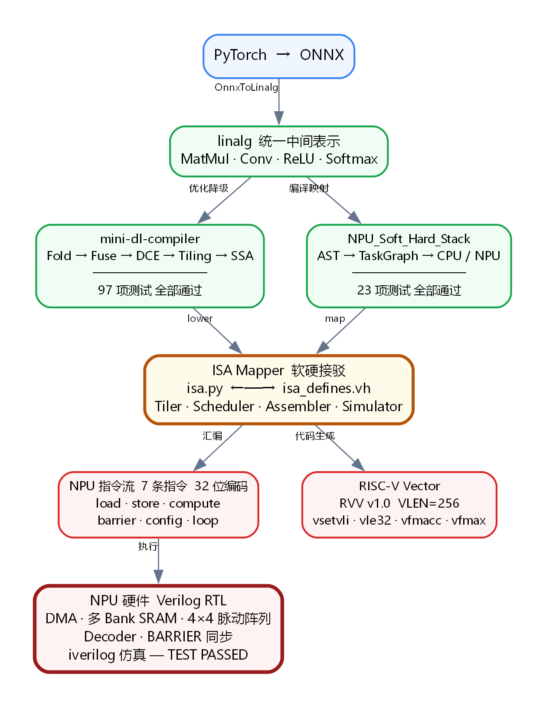
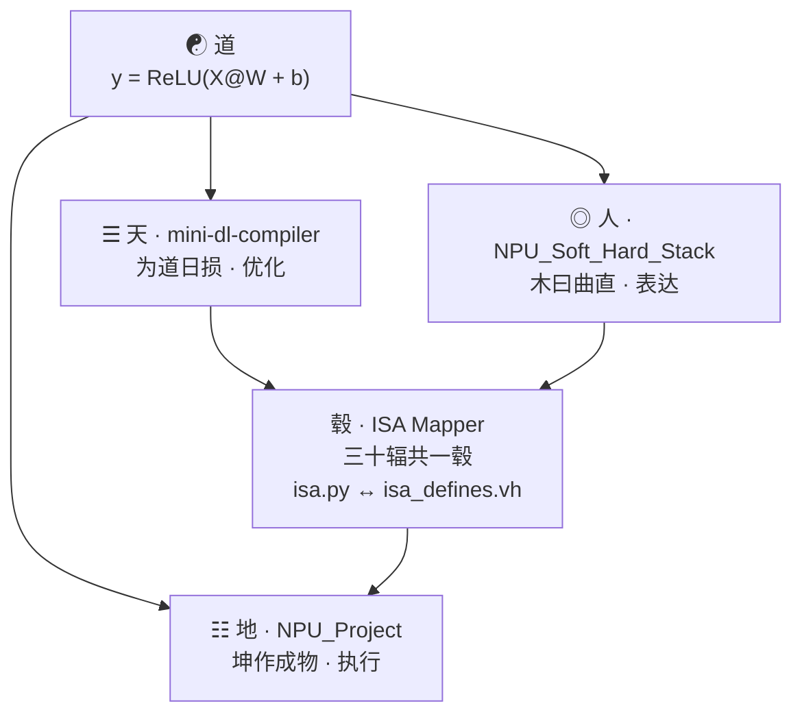

# DL-Compiler-DAO：道器编译 · 深度学习编译器易学导论

📌 全栈概要：PyTorch/ONNX 前端 → MLIR 多级降级 (Linalg→RVV) → 自研 NPU 硬件 (Verilog) + 双后端调度。单元测试覆盖 120 个用例。

## 「全栈架构图」

## 如果这是一口灶台
若把深度学习模型和NPU芯片分别比作一份**菜谱**和一口**铁锅**，
那中间隔着几十层的翻译（编译器），就是切菜与掌勺的手。
这个仓库把"从脑子里想的一份菜谱到铁锅里熟"的物理过程，拆成了三个独立的工程。

## 全栈五层结构（内功心法）
- **道**：最高层的数学意图（菜谱）。
- **三才**：左"三天"（精简优化）与右"人"（表达翻译）。
- **毂**：软硬接驳（ISA Mapper，车轴汇聚处）。
- **地**：物理执行（NPU 芯片，坤作成物）。
- **长线**：道器不二，从想法直抵物理。

## 三大工程索引（实修功夫）
- **卷壹：[NPU_Soft_Hard_Stack]** 对应"人"与"地"：
  看懂菜谱，下锅炒（前端解析与后端执行）。
  不管菜谱是来自 PyTorch 还是 ONNX，系统都要把它拆成有序的流程图。
  真正落地的"软硬接驳"处，集中在项目里的 `isa.py`（软件映射）和 `isa_defines.vh`（硬件定义）这两个接口上。

- **卷贰：[mini-dl-compiler]** 对应"三天"与"毂"：
  合并动作，教机器切菜（优化 Pass 与层层降级）。
  从最高级的算子融合、Tiling 分块，一路降到电机看得懂的指令（Linalg → Affine → SCF → LLVM → RVV）。
  再复杂的 AI，到最后不过是电路板上简单的"通"与"断"。

- **卷叁：[NPU_Project]** 对应"地"与"长线"：
  造自动炒菜机，装防乱翻开关（NPU 硬件设计与同步验证）。
  DMA 搬运数据，SRAM 极速存取，PE 阵列多铲齐下。
  最核心的是那道 `BARRIER` 防乱开关——左边没翻上来，右边绝不往下压。不盲目乱冲，系统才能长期稳。

## 三、**道是脑子里的意图，即为静；器是电流过的铜线，即为动。静动结合向来是一体化的**

图最左侧有一条贯穿的长线：道器不二，从想法直抵物理。
无论中间通过多少个步骤，数学菜谱落进 NPU 硅片的那一刻，编译器的使命就达成了。
