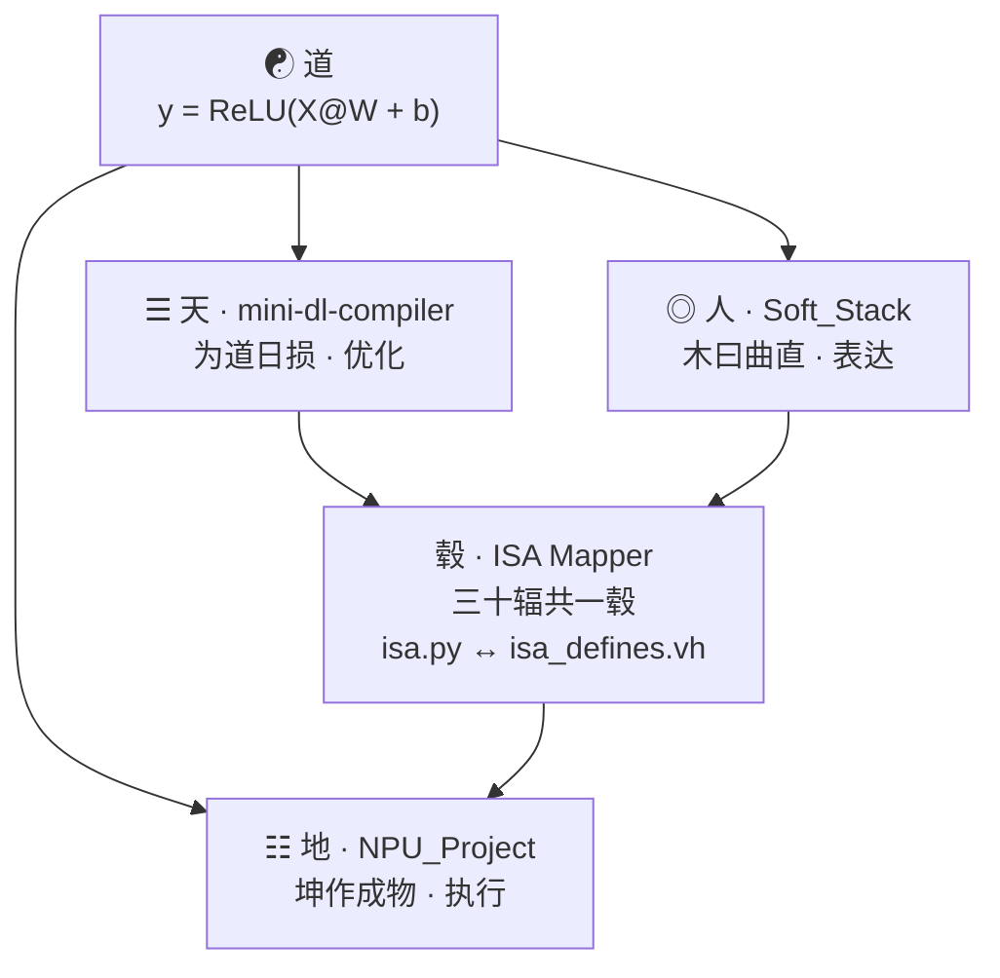

# 深度学习编译器的易学视觉:道论编译

三个开源项目，从表达式到 NPU 硬件指令全打通。

- **mini-dl-compiler** — 编译优化引擎 (96 tests)
- **NPU_Soft_Hard_Stack** — 编译前端 (23 tests)
- **NPU_Project** — Verilog RTL 硬件 (仿真OK)

---

## 架构图



五行流转：木(前端) → 土(IR) → 火(优化) → 金(代码生成) → 水(硬件)

---

## 怎么跑

```bash
cd mini-dl-compiler && pytest      # 96 pass
cd NPU_Soft_Hard_Stack && pytest   # 23 pass
cd NPU_Project/sim && make         # 仿真 OK
```

## 能力

全链路通(AST→RTL) · 图优化(Fold/Fuse/DCE/Tiling/Memory/SSA) · ISA 软硬同步(isa.py ↔ isa_defines.vh) · 120 tests 全绿

## 差距

算子少跑不了 ResNet · 没接 MLIR/LLVM · RTL 4×4 INT32 没综合

