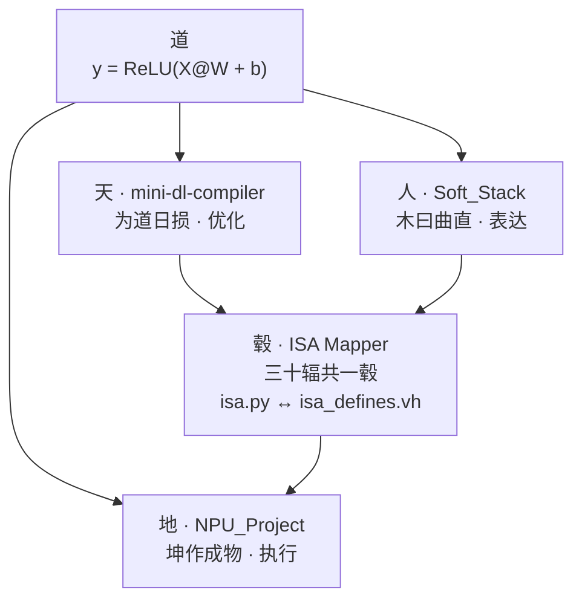

# 深度学习编译器的易学导论：道论编译

> 一个算式，流转三态。`y = ReLU(X@W + b)` 从优化到表达到硬件，全链路打通。

---

## 三秒速览

| 层级 | 项目 | 编译器角色 | 一句话 |
|:---:|------|:---------:|--------|
| 天 | [mini-dl-compiler](./mini-dl-compiler) | 后端优化 | 图优化 + 代码生成，96 tests |
| 人 | [NPU_Soft_Hard_Stack](./NPU_Soft_Hard_Stack) | 前端表达 | AST to IR lowering，23 tests |
| 地 | [NPU_Project](./NPU_Project) | 硬件执行 | Verilog RTL，仿真 OK |
| 毂 | `isa.py` / `isa_defines.vh` | ISA 翻译桥 | 软件指令与硬件信号一键同步 |

管线：前端 → IR → 优化 → 代码生成 → 硬件

---

## 架构



- 天 (mini-dl-compiler)：图优化引擎，Fold / Fuse / DCE / Tiling / Memory / SSA
- 人 (Soft_Stack)：AST 到 IR 的 lowering，算子表达
- 地 (NPU_Project)：Verilog RTL，硬件执行单元
- 毂 (ISA Mapper)：软件指令与硬件 define 双向同步，三十辐共一毂

---

## 怎么跑

```bash
cd mini-dl-compiler && pytest      # 96 pass
cd NPU_Soft_Hard_Stack && pytest   # 23 pass
cd NPU_Project/sim && make         # 仿真 OK
```

---

## 已打通

- AST to IR to Optim to RTL 全链路
- 图优化 6 种：Fold / Fuse / DCE / Tiling / Memory / SSA
- ISA 软硬一键同步：Python 端改完，Verilog 端自动更新
- 120 tests 全绿

## 待补

- 接入 MLIR / LLVM 生态
- 跑通 ResNet 端到端
- RTL 综合，上板验证
- 更多算子：Conv / Gemm / Softmax

