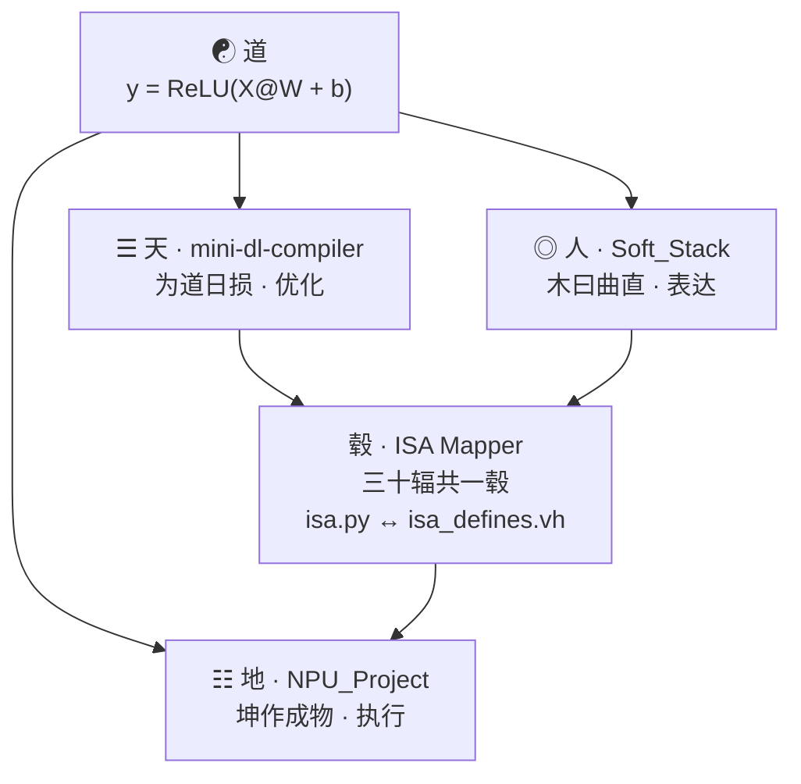

# DL-Compiler-DAO：道器编译 · 深度学习编译器易学导论

三个开源项目，从数学表达式到 NPU 硬件指令的全栈打通。

## 如果这是一口灶台
若把深度学习模型和NPU芯片分别比作一份**菜谱**和一口**铁锅**，
那中间隔着几十层的翻译（编译器），就是切菜与掌勺的手。
这个仓库把“从脑子里想的一份菜谱到铁锅里熟”的物理过程，拆成了三个独立的工程。

## 全栈五层结构
- **道**：最高层的数学意图（菜谱）。
- **三才**：左“三天”（精简优化）与右“人”（表达翻译）。
- **毂**：软硬接驳（ISA Mapper，车轴汇聚处）。
- **地**：物理执行（NPU 芯片，坤作成物）。
- **长线**：道器不二，从想法直抵物理。

## 三大工程索引
- **[NPU_Soft_Hard_Stack]** 卷壹：看懂菜谱，下锅炒（前端解析与后端执行）。
- **[mini-dl-compiler]** 卷贰：合并动作，教机器切菜（优化 Pass 与层层降级）。
- **[NPU_Project]** 卷叁：造自动炒菜机，装防乱翻开关（NPU 硬件设计与同步验证）。

---

## 架构图

